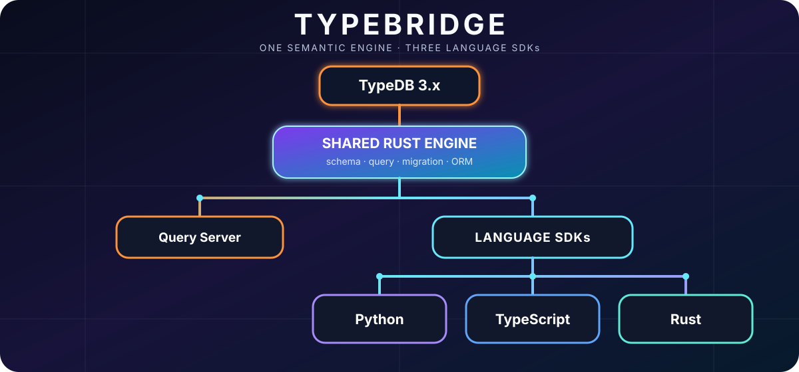

<p align="center">
  
</p>

# Build typed TypeDB applications

TypeBridge is a multi-language application toolkit for TypeDB. Define a schema
once, project typed models for Python, TypeScript/Node, and Rust, then use the
same Rust-owned query, migration, validation, and ORM semantics locally or
through the TypeBridge server.

<div class="grid cards" markdown>

-   :fontawesome-brands-python:{ .lg .middle } **Python**

    ---

    Declarative Pydantic models, schema management, CRUD, expressions, and
    immutable typed queries.

    [:octicons-arrow-right-24: Python quick start](getting-started/quickstart.md)

-   :fontawesome-brands-node-js:{ .lg .middle } **TypeScript / Node**

    ---

    Branded attributes, typed managers, native execution, model generation,
    and direct or remote queries.

    [:octicons-arrow-right-24: Node SDK](guide/typescript.md)

-   :fontawesome-brands-rust:{ .lg .middle } **Rust**

    ---

    Generated schema crates, async CRUD, transactions, and immutable queries
    bound to a canonical schema.

    [:octicons-arrow-right-24: Rust client](guide/rust.md)

-   :material-server-security:{ .lg .middle } **Schema and server**

    ---

    Versioned Split-YAML workspaces, migrations, multi-target generation, and a
    hardened remote query server.

    [:octicons-arrow-right-24: Schema workflows](guide/schema-workflows.md)

</div>

## One semantic engine

```text
Split-YAML / TypeQL schema
             │
             ▼
  Rust schema · query · migration · ORM
       │             │              │
       ▼             ▼              ▼
    Python     TypeScript/Node    Rust SDK
       └─────────────┬──────────────┘
                     ▼
              TypeDB 3.x / server
```

Python and Node are typed language facades, not independent implementations.
Generated Rust applications and the standalone server consume the same
canonical contracts. This keeps cardinality, roles, inheritance, value
coercion, query validation, and migration behavior aligned.

## Choose a path

- New to TypeBridge? [Install the surface you need](getting-started/installation.md).
- Modeling entities and relations? Start with [modeling TypeDB data](guide/models.md).
- Building reads and writes? Use the [data workflows](guide/data.md).
- Owning schema evolution? Follow [schema and migration workflows](guide/schema-workflows.md).
- Evaluating languages and deployment shapes? [Compare the SDKs](guide/sdks.md).
- Upgrading an application? Read [Upgrading to 2.0](guide/upgrade-v2.md) and
  the exact [deprecation inventory](guide/v2-deprecations.md).
- Contributing? Start with the [development guide](development/index.md).

!!! note "Compatibility"

    TypeBridge 2.0.x supports TypeDB 3.8–3.12. TypeDB 3.8 and 3.10 support is
    deprecated for removal in TypeBridge 2.1. See the
    [server and driver matrix](development/typedb.md#server-and-driver-compatibility).
